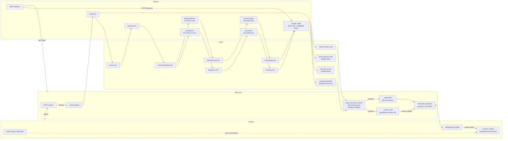
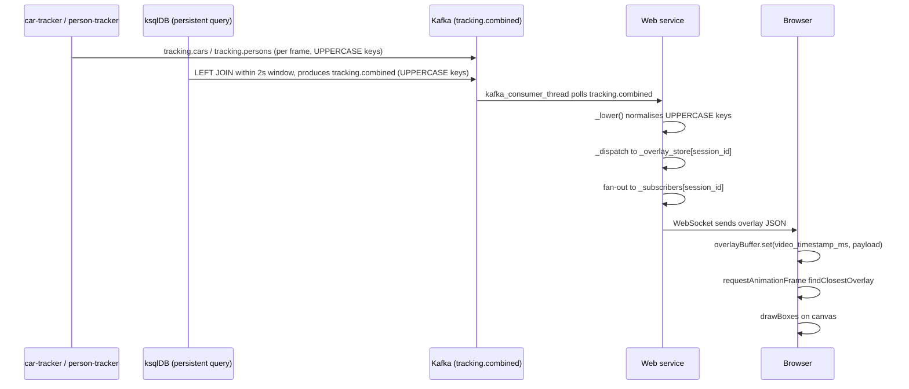

# Capstone: E2E Video Analytics Pipeline

Real-time car and person detection/tracking pipeline built on Apache Kafka. Upload a video in the browser, watch it play with bounding box overlays, and see live statistics — before the full video has been processed.

---

## Architecture



---

## Overlay synchronization detail



Sync is by **`video_timestamp_ms`** (milliseconds from start of video file, set by OpenCV `cap.get(CAP_PROP_POS_MSEC)`). The browser searches for the buffered overlay whose timestamp is closest to `video.currentTime * 1000`, within a 2-second tolerance.

ksqlDB serialises all JSON field names in **UPPERCASE**. The `_lower()` utility in `common/kafka_client.py` recursively lowercases all dict keys before dispatch so the browser receives standard lowercase field names.

Because the detection pipeline runs faster than playback speed, all overlays for the whole video arrive at the browser before the video finishes playing. The browser stores them all in `overlayBuffer` (a `Map<ms, payload>`) and looks up the right one each animation frame.

---

## WebSocket connection lifecycle


`_overlay_store` is never deleted (within a web process lifetime). A second user or page reload immediately replays all stored overlays, then continues live.

---

## Services

| Container | Port | Role |
|---|---|---|
| `topic-init` | — | One-shot: creates Kafka topics; exits 0 |
| `ksql-init` | — | One-shot: creates ksqlDB streams, LEFT JOIN, and aggregate tables; exits 0 |
| `generator` | — | Reads uploaded video frame-by-frame → `frames.raw`; emits `control.session_end` |
| `preprocessor` | — | Resizes frames to 640×640 → `frames.preprocessed` |
| `car-detector` | — | YOLOv8n class IDs 2,5,7 → `detections.cars` (shared image with person-detector) |
| `person-detector` | — | YOLOv8n class ID 0 → `detections.persons` |
| `car-tracker` | — | CentroidTracker → `tracking.cars` (shared image with person-tracker) |
| `person-tracker` | — | CentroidTracker → `tracking.persons` |
| `statistics` | 8002 | FastAPI `GET /stats`; pulls counts from ksqlDB aggregate tables via HTTP |
| `web` | 8080 | Upload, video serve, WebSocket overlay stream (from `tracking.combined`), UI |
| ksqlDB (infra) | 8088 | Joins `tracking.cars` + `tracking.persons` → `tracking.combined`; maintains `session_car_stats` / `session_person_stats` aggregate tables |

---

## ksqlDB Objects

| Object | Type | Kafka topic | Description |
|---|---|---|---|
| `tracking_cars_raw` | Stream | `tracking.cars` | Source stream for car tracking messages |
| `tracking_persons_raw` | Stream | `tracking.persons` | Source stream for person tracking messages |
| `tracking_cars_rekeyed` | Stream | `tracking.cars.rekeyed` | Rekeyed by `session_id + '_' + frame_number` for join |
| `tracking_persons_rekeyed` | Stream | `tracking.persons.rekeyed` | Rekeyed by `session_id + '_' + frame_number` for join |
| `tracking_combined` | Stream | `tracking.combined` | LEFT JOIN within 2s window / 0.5s grace; consumed by web |
| `session_car_stats` | Table | `session.car.stats` | `LATEST_BY_OFFSET(total_unique)` per session; state store for statistics |
| `session_person_stats` | Table | `session.person.stats` | `LATEST_BY_OFFSET(total_unique)` per session; state store for statistics |

The statistics service queries `session_car_stats` and `session_person_stats` via ksqlDB pull queries (`POST /query-stream`) — no Kafka consumer in statistics.

---

## Neural Network: YOLOv8n

Pre-trained COCO 80-class model, nano variant (~6 MB weights).

| Class IDs | Objects |
|---|---|
| 0 | person |
| 2, 5, 7 | car, bus, truck |

**Tracking:** CentroidTracker — distance-matrix greedy matching, 30-frame disappear window.

### CPU vs GPU (`PROCESSING_UNIT_TYPE`)

The detector image is built for a specific compute back-end selected at **build time** via the `PROCESSING_UNIT_TYPE` build arg.  The same env var is passed at runtime to tell ultralytics which device to use.

| `PROCESSING_UNIT_TYPE` | torch wheels installed | typical throughput |
|---|---|---|
| `cpu` (default) | CPU-only (~200 MB) | ~5 fps |
| `cuda` | CUDA 12.1 (~2 GB) | ~80–200 fps |

> **Why build-time?** CPU-only and CUDA torch are different PyPI packages resolved from different index URLs.  Swapping them at runtime would require reinstalling torch inside the container.  Building two distinct images (one per value) is the standard pattern.

#### Building and running with GPU

```bash
# 1. Build the CUDA-enabled detector images
PROCESSING_UNIT_TYPE=cuda docker compose \
  -f docker-compose.yaml -f docker-compose.gpu.yaml \
  --profile app build car-detector person-detector

# 2. Start the full stack with GPU detectors
PROCESSING_UNIT_TYPE=cuda docker compose \
  -f docker-compose.yaml -f docker-compose.gpu.yaml \
  --profile app up -d
```

`docker-compose.gpu.yaml` adds the NVIDIA device reservation (`deploy.resources.reservations.devices`) to both detector services.  The base `docker-compose.yaml` does **not** include this block, so CPU builds work without the NVIDIA Container Toolkit installed.

#### WSL2 prerequisites (NVIDIA)

```bash
# On the Windows host: NVIDIA driver >= 470.76 (supports WSL2 CUDA passthrough)
# Inside WSL2:
curl -fsSL https://nvidia.github.io/libnvidia-container/gpgkey | sudo gpg --dearmor -o /usr/share/keyrings/nvidia-container-toolkit-keyring.gpg
curl -s -L https://nvidia.github.io/libnvidia-container/stable/deb/nvidia-container-toolkit.list \
  | sed 's#deb https://#deb [signed-by=/usr/share/keyrings/nvidia-container-toolkit-keyring.gpg] https://#g' \
  | sudo tee /etc/apt/sources.list.d/nvidia-container-toolkit.list
sudo apt-get update && sudo apt-get install -y nvidia-container-toolkit
sudo nvidia-ctk runtime configure --runtime=docker
sudo systemctl restart docker

# Verify: should print your GPU name
docker run --rm --gpus all nvidia/cuda:12.1.0-base-ubuntu22.04 nvidia-smi
```

---

## Kafka Topics

| Topic | Partitions | Max message | Key | Producer |
|---|---|---|---|---|
| `frames.raw` | 3 | 5 MB | session_id | generator |
| `frames.preprocessed` | 3 | 5 MB | session_id | preprocessor |
| `detections.cars` | 3 | 256 KB | session_id | car-detector |
| `detections.persons` | 3 | 256 KB | session_id | person-detector |
| `tracking.cars` | 3 | 256 KB | session_id | car-tracker |
| `tracking.persons` | 3 | 256 KB | session_id | person-tracker |
| `control.upload` | 1 | 4 KB | session_id | web |
| `control.session_end` | 1 | 4 KB | session_id | generator |
| `tracking.combined` | 3 | — | session_id | ksqlDB (stream join) |
| `session.car.stats` | 3 | — | session_id | ksqlDB (aggregate table) |
| `session.person.stats` | 3 | — | session_id | ksqlDB (aggregate table) |

`session_id` (UUID) as Kafka key → `hash(session_id) % 3` routes all messages for one session to the same partition, preserving per-session ordering without coordination.

---

## Statistics API

`GET http://localhost:8002/stats` (also proxied at `GET http://localhost:8080/stats`)

The statistics service issues ksqlDB pull queries against the `session_car_stats` and `session_person_stats` materialized tables to read the latest cumulative unique counts per session.

```json
{
  "sessions": {
    "aaa-bbb": {"unique_cars": 5, "unique_persons": 12}
  }
}
```

---

## Quickstart

A `Makefile` wraps all common operations so you don't need to type long `docker compose` commands with multiple `-f` flags.

### CPU (default)

```bash
cd capstone
make infra-up
make build-cpu          # first time: ~5–10 min (downloads CPU torch ~200 MB)
make up-cpu
# open http://localhost:8080
```

### GPU (NVIDIA)

```bash
cd capstone
make infra-up
make build-gpu          # first time: ~15–20 min (downloads CUDA torch ~2 GB)
make up-gpu
# open http://localhost:8080
```

Both image variants can coexist in the local image store:

| Make target | Images built | torch size |
|---|---|---|
| `build-cpu` | `capstone-car-detector:cpu`, `capstone-person-detector:cpu` | ~200 MB |
| `build-gpu` | `capstone-car-detector:cuda`, `capstone-person-detector:cuda` | ~2 GB |

After building both, switching between runtimes is just `make up-cpu` / `make up-gpu` — no rebuild needed.

### Hybrid (infra in Docker, services run manually)

```bash
docker compose --profile infra up -d
cd services
pip install confluent-kafka fastapi uvicorn python-multipart httpx jinja2 aiofiles websockets requests
pip install torch torchvision --index-url https://download.pytorch.org/whl/cpu
pip install ultralytics
export KAFKA_BOOTSTRAP_SERVERS=localhost:9092 PYTHONPATH=.
python topic_init/main.py
KSQLDB_URL=http://localhost:8088 python ksql_init/main.py
python generator/main.py &
python preprocessor/main.py &
CLASS_IDS=2,5,7 OUTPUT_TOPIC=detections.cars  GROUP_ID=detector-cars    python detector/main.py &
CLASS_IDS=0     OUTPUT_TOPIC=detections.persons GROUP_ID=detector-persons python detector/main.py &
OBJECT_TYPE=car    INPUT_TOPIC=detections.cars    OUTPUT_TOPIC=tracking.cars    GROUP_ID=tracker-car    python tracker/main.py &
OBJECT_TYPE=person INPUT_TOPIC=detections.persons OUTPUT_TOPIC=tracking.persons GROUP_ID=tracker-person python tracker/main.py &
KSQLDB_URL=http://localhost:8088 python statistics/main.py &
UPLOAD_DIR=/tmp/uploads python web/main.py
```

---

## Verifying CPU vs GPU at runtime

### 1. Startup log (fastest)

The detector logs the device it will use before consuming any frames:

```bash
docker logs car-detector 2>&1 | grep "device="
# CPU:  … Loading YOLOv8n model  class_ids=[2, 5, 7]  device=cpu
# GPU:  … Loading YOLOv8n model  class_ids=[2, 5, 7]  device=cuda
```

### 2. torch inside the container

```bash
docker exec car-detector python -c "import torch; print(torch.cuda.is_available())"
# False → CPU image    True → CUDA image
```

`True` means the CUDA build is installed **and** a GPU is visible to the container. `False` on a `cuda`-tagged container means the NVIDIA runtime is not set up correctly.

### 3. GPU utilisation during a run (ground truth)

While a video is being processed, GPU utilisation should be non-zero:

```bash
nvidia-smi
# Watch: the python process in the car-detector / person-detector container
# should show memory usage and > 0 % GPU-Util
```

If `nvidia-smi` shows 0 % during processing despite using `make up-gpu`, the container is falling back to CPU — check that `torch.cuda.is_available()` returns `True` inside the container (step 2).

---

## Rebuild a single service

```bash
# CPU
docker compose --profile app build --no-cache <service-name>
docker compose --profile app up -d --no-recreate

# GPU (detectors only — they are the only GPU-aware services)
make build-gpu
make up-gpu
```

---

## Verification

```bash
# All Kafka topics created
docker exec broker kafka-topics --bootstrap-server broker:29092 --list

# ksqlDB streams and tables
curl -s http://localhost:8088/ksql \
  -H 'Content-Type: application/vnd.ksql.v1+json' \
  -d '{"ksql":"LIST STREAMS;"}' | python3 -m json.tool

curl -s http://localhost:8088/ksql \
  -H 'Content-Type: application/vnd.ksql.v1+json' \
  -d '{"ksql":"SHOW TABLES;"}' | python3 -m json.tool
# Should list: SESSION_CAR_STATS, SESSION_PERSON_STATS

# Statistics (backed by ksqlDB pull queries)
curl -s http://localhost:8002/stats | python3 -m json.tool

# Consumer group lag
docker exec broker kafka-consumer-groups \
  --bootstrap-server broker:29092 --all-groups --describe
```

---

## Project Structure

```
capstone/
├── docker-compose.yaml      # profile: infra (Kafka stack) + profile: app (pipeline)
├── input.mp4                # sample test video
├── README.md
└── services/
    ├── common/
    │   ├── kafka_client.py      # make_producer, make_consumer, produce_with_backpressure, _lower
    │   └── centroid_tracker.py  # CentroidTracker
    ├── topic_init/              # Dockerfile  main.py  requirements.txt
    ├── ksql_init/               # Dockerfile  main.py  requirements.txt  (7 ksqlDB objects)
    ├── generator/               # Dockerfile  main.py  requirements.txt
    ├── preprocessor/            # Dockerfile  main.py  requirements.txt
    ├── detector/                # shared image: car-detector + person-detector
    ├── tracker/                 # shared image: car-tracker + person-tracker
    ├── statistics/              # Dockerfile  main.py  requirements.txt  (ksqlDB pull queries)
    └── web/
        ├── Dockerfile
        ├── main.py
        ├── requirements.txt
        └── templates/
            ├── index.html       # upload form
            └── view.html        # HTML5 video + canvas overlay + live stats
```
