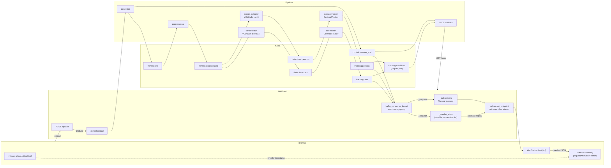
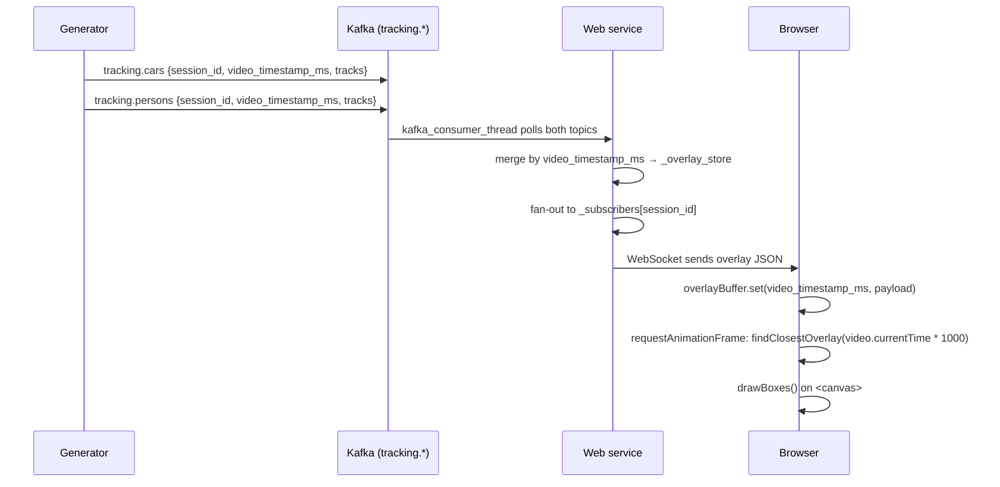
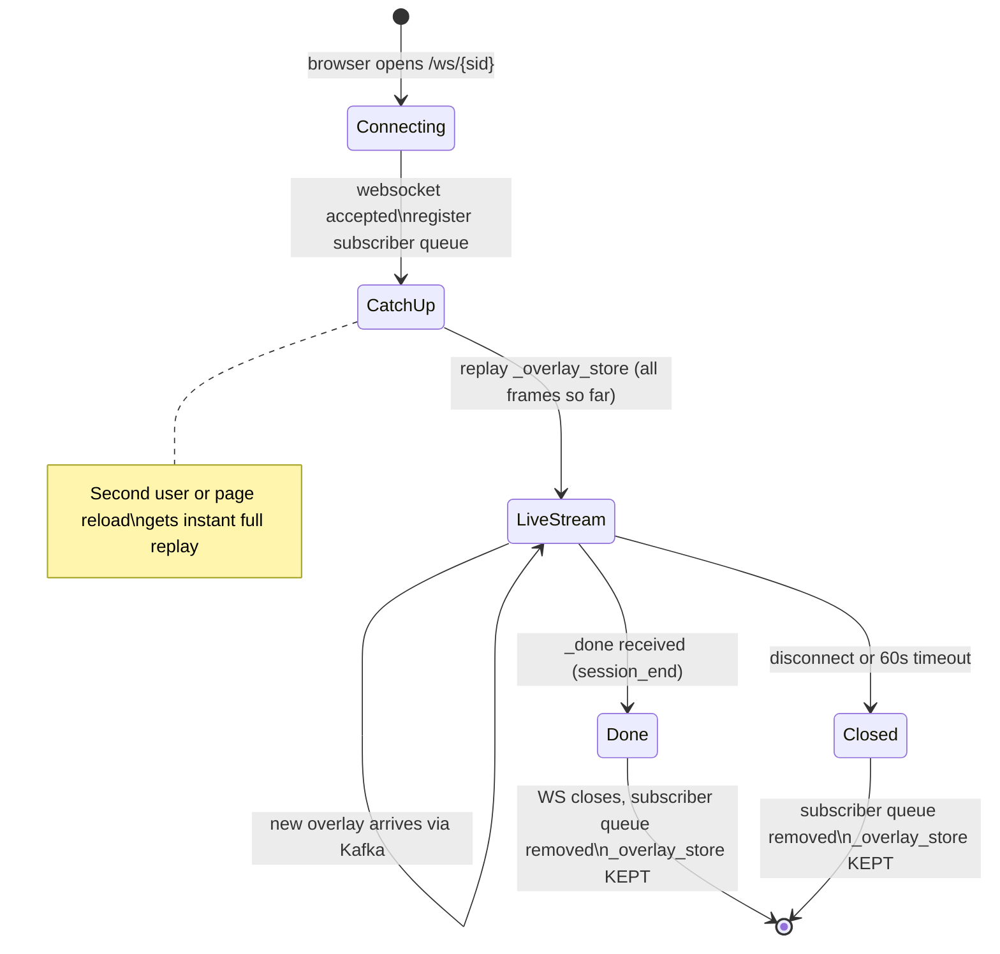

# Capstone: E2E Video Analytics Pipeline

Real-time car and person detection/tracking pipeline built on Apache Kafka. Upload a video in the browser, watch it play with bounding box overlays, and see live statistics — before the full video has been processed.

---

## Architecture



---

## Overlay synchronization detail



Sync is by **`video_timestamp_ms`** (milliseconds from start of video file, set by OpenCV `cap.get(CAP_PROP_POS_MSEC)`). The browser searches for the buffered overlay whose timestamp is closest to `video.currentTime * 1000`, within a 2-second tolerance.

Because the detection pipeline runs faster than playback speed, all overlays for the whole video arrive at the browser before the video finishes playing. The browser stores them all in `overlayBuffer` (a `Map<ms, payload>`) and looks up the right one each animation frame.

---

## WebSocket connection lifecycle



`_overlay_store` is never deleted (within a web process lifetime). A second user or page reload immediately replays all stored overlays, then continues live.

---

## Services

| Container | Port | Role |
|---|---|---|
| `topic-init` | — | One-shot: creates 8 Kafka topics; exits 0 |
| `ksql-init` | — | One-shot: creates ksqlDB streams + LEFT JOIN on tracking topics; exits 0 |
| `generator` | — | Reads uploaded video frame-by-frame → `frames.raw`; emits `control.session_end` |
| `preprocessor` | — | Resizes frames to 640×640 → `frames.preprocessed` |
| `car-detector` | — | YOLOv8n class IDs 2,5,7 → `detections.cars` (shared image with person-detector) |
| `person-detector` | — | YOLOv8n class ID 0 → `detections.persons` |
| `car-tracker` | — | CentroidTracker → `tracking.cars` (shared image with person-tracker) |
| `person-tracker` | — | CentroidTracker → `tracking.persons` |
| `statistics` | 8002 | Consumes `tracking.combined` (ksqlDB output); FastAPI `GET /stats` |
| `web` | 8080 | Upload, video serve, WebSocket overlay stream, UI |
| ksqlDB (infra) | 8088 | Joins `tracking.cars` + `tracking.persons` → `tracking.combined` |

---

## Neural Network: YOLOv8n (CPU)

Pre-trained COCO 80-class model, nano variant (~6 MB weights).

| Class IDs | Objects |
|---|---|
| 0 | person |
| 2, 5, 7 | car, bus, truck |

**Tracking:** CentroidTracker — distance-matrix greedy matching, 30-frame disappear window, no GPU required.

---

## Kafka Topics

| Topic | Partitions | Max message | Key | Producer |
|---|---|---|---|---|
| `frames.raw` | 3 | 5 MB | session_id | generator |
| `frames.preprocessed` | 3 | 5 MB | session_id | preprocessor |
| `detections.cars` | 3 | 256 KB | session_id | car-detector |
| `detections.persons` | 3 | 256 KB | session_id | person-detector |
| `tracking.cars` | 3 | 256 KB | session_id | car-tracker |
| `tracking.persons` | 3 | 256 KB | session_id | person-tracker |
| `control.upload` | 1 | 4 KB | session_id | web |
| `control.session_end` | 1 | 4 KB | session_id | generator |
| `tracking.combined` (ksqlDB) | 3 | — | session_id | ksqlDB stream join |

`session_id` (UUID) as Kafka key → `hash(session_id) % 3` routes all messages for one session to the same partition, preserving per-session ordering without coordination.

---

## Statistics API

`GET http://localhost:8002/stats` (also proxied at `GET http://localhost:8080/stats`)

```json
{
  "sessions": {
    "aaa-bbb": {"unique_cars": 5, "unique_persons": 12, "status": "done"}
  },
  "global": {"unique_cars": 8, "unique_persons": 20}
}
```

Global counts use `(session_id, track_id)` tuples — track IDs reset to 0 per session.

---

## Quickstart

### Full Docker Compose

```bash
cd capstone
docker compose --profile infra up -d
docker compose --profile app build --no-cache     # first time: ~5–10 min (downloads torch)
docker compose --profile app up -d
# open http://localhost:8080
```

### Hybrid (infra in Docker, services run manually)

```bash
docker compose --profile infra up -d
cd services
pip install confluent-kafka fastapi uvicorn python-multipart httpx jinja2 aiofiles websockets
pip install torch torchvision --index-url https://download.pytorch.org/whl/cpu
pip install ultralytics
export KAFKA_BOOTSTRAP_SERVERS=localhost:9092 PYTHONPATH=.
python topic_init/main.py
KSQLDB_URL=http://localhost:8088 python ksql_init/main.py
python generator/main.py &
python preprocessor/main.py &
CLASS_IDS=2,5,7 OUTPUT_TOPIC=detections.cars  GROUP_ID=detector-cars    python detector/main.py &
CLASS_IDS=0     OUTPUT_TOPIC=detections.persons GROUP_ID=detector-persons python detector/main.py &
OBJECT_TYPE=car    INPUT_TOPIC=detections.cars    OUTPUT_TOPIC=tracking.cars    GROUP_ID=tracker-car    python tracker/main.py &
OBJECT_TYPE=person INPUT_TOPIC=detections.persons OUTPUT_TOPIC=tracking.persons GROUP_ID=tracker-person python tracker/main.py &
python statistics/main.py &
UPLOAD_DIR=/tmp/uploads python web/main.py
```

---

## Rebuild a single service

```bash
docker compose --profile app build --no-cache <service-name>
docker compose --profile app up -d --no-recreate
```

---

## Verification

```bash
# 8 application topics created
docker exec broker kafka-topics --bootstrap-server broker:29092 --list

# ksqlDB join stream exists
curl -s http://localhost:8088/ksql \
  -H 'Content-Type: application/vnd.ksql.v1+json' \
  -d '{"ksql":"LIST STREAMS;"}' | python3 -m json.tool

# Statistics
curl -s http://localhost:8002/stats | python3 -m json.tool

# Consumer group lag
docker exec broker kafka-consumer-groups \
  --bootstrap-server broker:29092 --all-groups --describe
```

---

## Project Structure

```
capstone/
├── docker-compose.yaml      # profile: infra (Kafka stack) + profile: app (pipeline)
├── input.mp4                # sample test video
├── README.md
└── services/
    ├── common/
    │   ├── kafka_client.py      # make_producer, make_consumer, produce_with_backpressure
    │   └── centroid_tracker.py  # CentroidTracker
    ├── topic_init/              # Dockerfile  main.py  requirements.txt
    ├── ksql_init/               # Dockerfile  main.py  requirements.txt
    ├── generator/               # Dockerfile  main.py  requirements.txt
    ├── preprocessor/            # Dockerfile  main.py  requirements.txt
    ├── detector/                # shared image: car-detector + person-detector
    ├── tracker/                 # shared image: car-tracker + person-tracker
    ├── statistics/              # Dockerfile  main.py  requirements.txt
    └── web/
        ├── Dockerfile
        ├── main.py
        ├── requirements.txt
        └── templates/
            ├── index.html       # upload form
            └── view.html        # HTML5 video + canvas overlay + live stats
```
