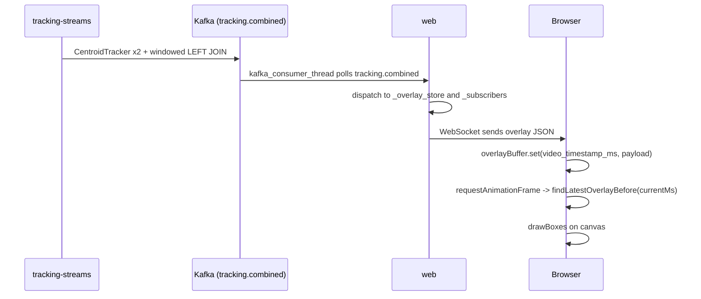
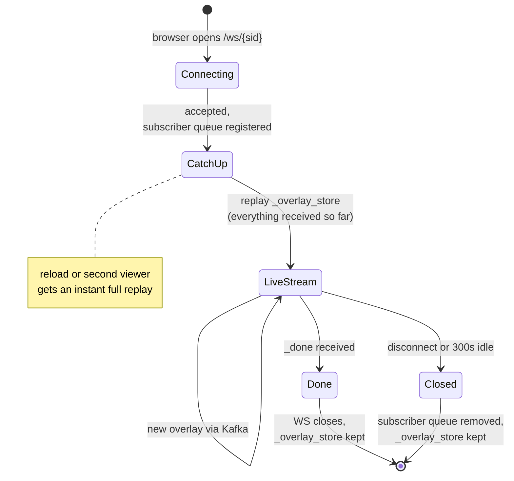

# Technical notes

Implementation details for the `web` service and the browser player — split out of the
main README because they're only relevant when debugging playback/overlay issues.

---

## Overlay synchronization

The sync key is `video_timestamp_ms`, set once by the generator via OpenCV's
`cap.get(CAP_PROP_POS_MSEC)` and carried unchanged through every downstream message.



The browser keeps every overlay it has ever received in `overlayBuffer`
(`Map<video_timestamp_ms, payload>`). On every animation frame it looks up the latest
overlay at or before `video.currentTime * 1000` and draws those boxes — it never shows a
future frame's boxes.

### Buffering / stall handling (`view.html`)

CPU YOLOv8n runs slower than realtime (~5 fps vs. 30 fps video), so playback has to wait
for the pipeline:

- On load, the video stays paused behind a "Buffering…" badge for `OVERLAY_BUFFER_DELAY_S`
  seconds (default `4`, from the env var of the same name).
- During playback, if `currentTime` catches up to the newest buffered overlay
  (`maxBufferedMs`), the video pauses and re-enters buffering.
- Resuming requires the buffer to be `RESUME_ADVANCE_MS` (= buffer delay / 2) ahead of the
  playhead, or the pipeline to have reached end-of-video — this hysteresis stops the
  player from flapping between play/pause every frame.
- `OVERLAY_STALE_TOLERANCE_MS` (500ms) only applies in the last 2s of the video, to absorb
  the structural gap between the last emitted overlay and `video.duration`.
- A `_done` message permanently exits buffering — by the time it arrives, every overlay
  for the session is guaranteed to already be buffered.

---

## WebSocket connection lifecycle



`_overlay_store[session_id]` is append-only and never deleted for the life of the `web`
process, so a page reload or a second browser tab gets a full replay before joining the
live stream. This is also why a long-running `web` process slowly accumulates memory per
session (known limitation — see `docs/memory/activeContext.md`).

### `_done` timing

`control.session_end` is produced by the generator as soon as it finishes reading the
input file — long before detection/tracking has caught up. `web` delays the `_done`
message to the browser by:

```
delay = max(MIN_DONE_DELAY_S, total_frames / DETECTION_FPS_ESTIMATE)
```

(`MIN_DONE_DELAY_S = 30`, `DETECTION_FPS_ESTIMATE` defaults to `5`, i.e. CPU YOLOv8n
throughput). Sending `_done` earlier would close the WebSocket while `tracking.combined`
records for the tail of the video are still in flight. On GPU, set
`DETECTION_FPS_ESTIMATE` higher so this wait isn't needlessly long.
