# Завдання №1 - Investigation of Kafka tools

# Зміст
1. [Kafka](#kafka)
2. [Redpanda](#redpanda)

## Kafka
### Docker ps
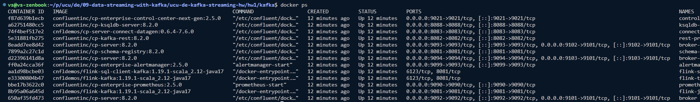
### Створення топіку
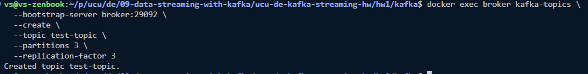
### Виведення списку топіків
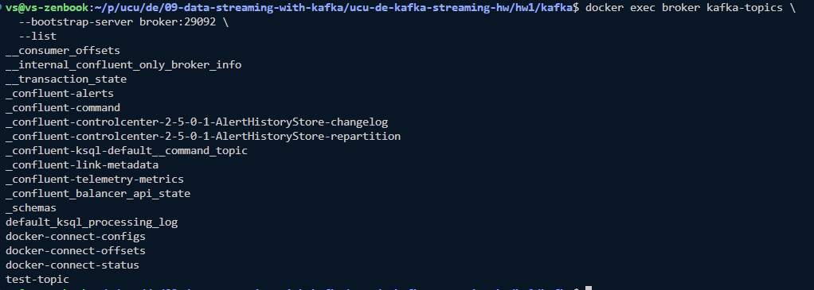
### Надсилання десяти повідомлень через console producer
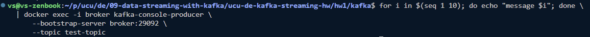
### Отримання повідомлень через console consumer
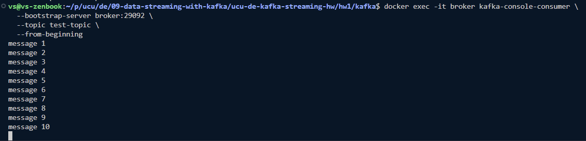
### Видалення топіку
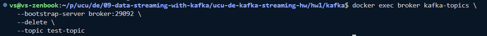

## Redpanda
### Docker ps
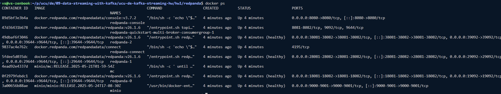
### Створення топіку
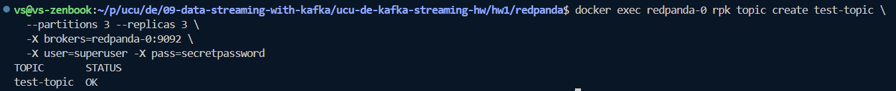
### Виведення списку топіків
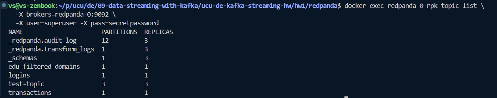
### Надсилання десяти повідомлень через console producer
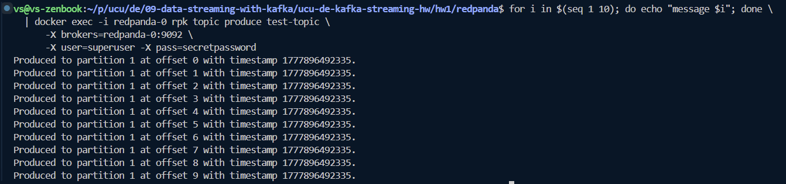
### Отримання повідомлень через console consumer
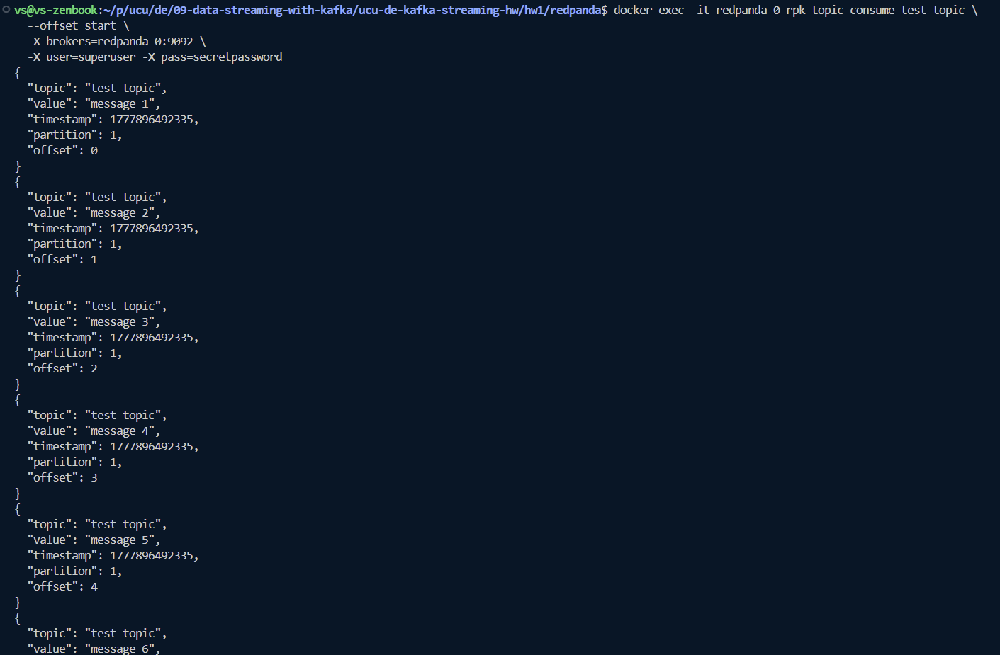
### Видалення топіку
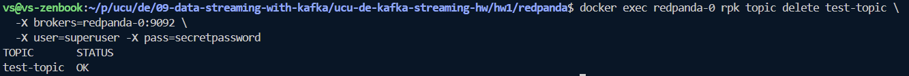