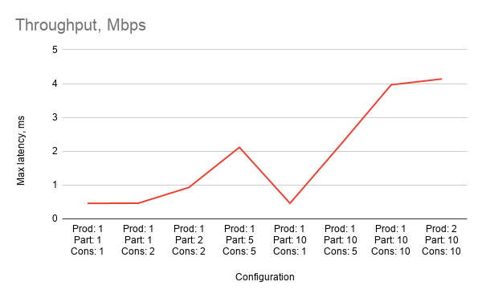
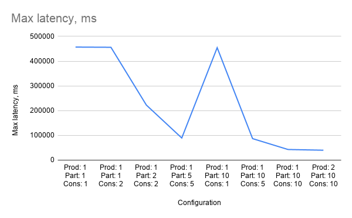
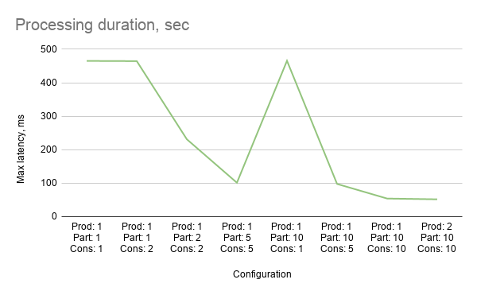

# Practical task - 2. Investigation of kafka throughput

## 1. Структура

- `producer` - читає `INPUT_FILE`, створює `NUM_PRODUCERS` потоків, відсилає кожен фрейм з відео як kafka-повідомлення з хедером `send_time_ms`
- `consumer` - створює `NUM_CONSUMERS` потоків (кожен потік містить один `KafkaConsumer`), читає повідомлення (симулюючи обробку односекнудною затримкою), заносить часові позначки в файл `output/consumer-N.csv`
- `stat-aggregator` - читає *.csv-файли й виводить пропускну здатність і максимальну затримку throughput (Mbps) and max latency
Run commands:

## 2. Запуск
### 2.1 Варіант 1: Кафка в докері, сервіси окремо
```bash
docker compose --profile infra up -d
java -jar producer/target/producer-1.0-SNAPSHOT.jar --bootstrap-servers localhost:9092 --num-producers 1 --num-partitions 1
java -jar consumer/target/consumer-1.0-SNAPSHOT.jar --bootstrap-servers localhost:9092 --num-consumers 1
java -jar stat-aggregator/target/stat-aggregator-1.0-SNAPSHOT.jar --output-dir ./output
```

### 2.2 Варіант 2: Кафка і сервіси через докер
```bash
docker compose --profile infra up -d
docker compose up --build consumer

docker compose run --build --rm producer

# Чекаємо, поки consumer завершить роботу
docker compose stop consumer
# Генеруємо статистику
docker compose run --build --rm stat-aggregator
```

## 3. Проведення експерименту

1. Запускаємо kafka-кластер
```bash
docker compose --profile infra up -d
```
2. Збираємо сервіси (одноразово)
```bash
docker compose build consumer producer stat-aggregator
```
3. Встановлюємо `NUM_PARTITIONS` / `NUM_PRODUCERS` / `NUM_CONSUMERS` в `.env`
4. Запускаємо замір:
```bash
./experiment.sh
```

Змінюємо конфігурацію, повторюємо.

## 4. Результати
### 4.1 Таблиця вимірювань
| Configuration (# producers/# partitions/# consumers) | Throughput, Mbps | Max latency, ms | Duration, sec |
| ---------------------------------------------------- | ---------------: | --------------: | ------------: |
| Prod: 1<br>Part: 1<br>Cons: 1                        |             0.46 |          456759 |        465.07 |
| Prod: 1<br>Part: 1<br>Cons: 2                        |            0.461 |          455901 |        464.49 |
| Prod: 1<br>Part: 2<br>Cons: 2                        |            0.927 |          222455 |        231.09 |
| Prod: 1<br>Part: 5<br>Cons: 5                        |            2.114 |           89326 |        101.28 |
| Prod: 1<br>Part: 10<br>Cons: 1                       |             0.46 |          454345 |        465.48 |
| Prod: 1<br>Part: 10<br>Cons: 5                       |            2.193 |           86788 |         97.64 |
| Prod: 1<br>Part: 10<br>Cons: 10                      |            3.963 |           42837 |         54.02 |
| Prod: 2<br>Part: 10<br>Cons: 10                      |            4.136 |           39889 |         51.77 |

### 4.2 Графіки
#### Пропускна здатність:  


#### Максимальна затримка:  


#### Загальна тривалість:  
