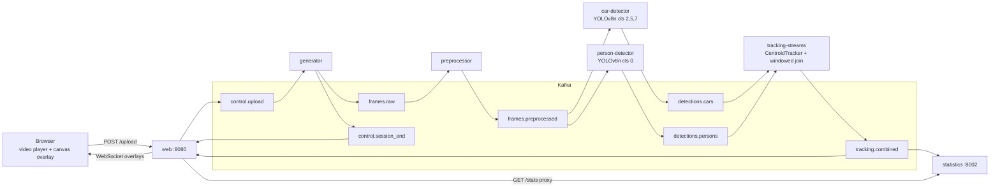

# Video Processing Pipeline: E2E Kafka Streaming

Kafka-based pipeline that detects and tracks cars and people in an uploaded video. The browser starts playing the video almost immediately and overlays live bounding boxes and running counts while detection is still catching up in the background.

---

## 1. Quickstart

**Prerequisites:**
- Docker + Docker Compose
- (Optional, for better performance) NVIDIA GPU with driver ≥ 470.76 and the NVIDIA Container Toolkit configured for Docker
  (see `docker-compose.gpu.yaml` for the WSL2 setup steps)
- No GPU? Use the commented CPU commands below instead

```bash
cd video-processing-pipeline

# Run Kafka cluster, schema registry, control center
make infra-up

# first run only — pulls CUDA torch (~2 GB), ~15-20 min
make build-gpu

# CPU-only alternative — pulls CPU torch (~200 MB), ~5-10 min
# make build-cpu

make up-gpu
# CPU-only alternative
# make up-cpu
```

Open http://localhost:8080 and upload a video.

---

## 2. Architecture

### 2.1 Overview

Every upload gets a `session_id` (UUID) that's used as the Kafka message key for every
message in the pipeline, so multiple uploads run side by side without interfering with
each other. The video flows through:

```
upload -> generator -> preprocessor -> {car,person}-detector (YOLOv8n)
       -> tracking-streams (tracking + join) -> web (overlays) / statistics (counts)
```

The browser plays the **original** uploaded file directly over HTTP and draws bounding
boxes on a `<canvas>` overlay, fed by a WebSocket and synced to the video's own
timestamp — no transcoded or annotated video ever goes through Kafka.

### 2.2 Diagram



### 2.3 Services

| Container | Port | Role |
|---|---|---|
| `topic-init` | — | One-shot: creates Kafka topics, exits 0 |
| `generator` | — | Reads the uploaded file frame-by-frame → `frames.raw`; emits `control.session_end` when done |
| `preprocessor` | — | Resizes frames to 640×640 → `frames.preprocessed` |
| `car-detector` | — | YOLOv8n, classes 2/5/7 (car/bus/truck) → `detections.cars` |
| `person-detector` | — | YOLOv8n, class 0 (person) → `detections.persons` |
| `tracking-streams` | — | Kafka Streams app: per-object tracking + windowed join → `tracking.combined` |
| `statistics` | 8002 | FastAPI, per-session unique car/person counts |
| `web` | 8080 | Upload UI, video serving, WebSocket overlay stream, proxies `/stats` |

`car-detector` and `person-detector` share one image, differentiated by `CLASS_IDS`,
`OUTPUT_TOPIC` and `GROUP_ID`.

### 2.4 Topics

| Topic | Partitions | Max msg | Producer |
|---|---|---|---|
| `control.upload` | 1 | 4 KB | web |
| `frames.raw` | 3 | 5 MB | generator |
| `frames.preprocessed` | 3 | 5 MB | preprocessor |
| `detections.cars` | 3 | 256 KB | car-detector |
| `detections.persons` | 3 | 256 KB | person-detector |
| `tracking.combined` | 3 | 256 KB | tracking-streams |
| `control.session_end` | 1 | 4 KB | generator |

`session_id` is the key on every topic, so `hash(session_id) % partitions` keeps a
session's messages on one partition without any extra coordination.

### 2.5 Tracking: Intersection over Union (IoU) + centroid

`tracking-streams` runs one `CentroidTracker` per object type (car, person), with each
session's state kept in a Kafka Streams state store. For every detection frame it does a
two-pass match between existing tracks and the new detections:

1. **IoU pass** — greedily pairs tracks and detections whose bounding boxes overlap by at
   least `MIN_IOU = 0.1`, highest overlap first. This keeps a track's ID stable for an
   object that's growing in frame (e.g. a car driving toward the camera), where the
   centroid barely moves but the box does.
2. **Centroid pass** — whatever's left over is matched by nearest centroid distance,
   capped at `MAX_DISTANCE = 200px`. This is the classic centroid-tracker behaviour for
   lateral motion.

Tracks unmatched for `MAX_DISAPPEARED = 30` frames are dropped; detections unmatched by
either pass become new tracks. Each tracker also keeps a cumulative set of every track ID
it has ever seen, which becomes the `*_total` (unique object) count per session.

### 2.6 Kafka Streams

`tracking-streams` (`services/tracking-streams`, Java) is a single Kafka Streams app. Its
topology:

1. Consume `detections.cars` / `detections.persons`, run the tracker above via a custom
   `Processor` backed by a persistent state store keyed by `session_id`.
2. Rekey each stream to `session_id_frame_number`.
3. Windowed `LEFT JOIN` (cars side anchored, 2s window + 500ms grace) to pair up car and
   person tracks for the same frame.
4. Rekey the joined result back to `session_id` and write it to `tracking.combined`.

This keeps tracker state, the join, and JSON (de)serialization in one JVM process — `web`
and `statistics` only ever need to read `tracking.combined`.

> Overlay synchronization and the WebSocket connection lifecycle are covered separately
> in [docs/technical.md](docs/technical.md).

---

## 3. Build

GPU (default — NVIDIA, CUDA 12.1 torch):

```bash
make build-gpu
# make build-cpu  # CPU-only alternative, no GPU needed
```

Both produce separate image tags (`car-detector:cpu` / `:cuda`, same for
person-detector) and can coexist — build both once and switch with `make up-cpu` /
`make up-gpu` without rebuilding. GPU builds need the NVIDIA Container Toolkit configured
for Docker; see the comments in `docker-compose.gpu.yaml` for the WSL2 setup steps.

To rebuild a single service after a code change:

```bash
docker compose --profile app build --no-cache <service-name>
docker compose --profile app up -d --no-recreate
```

---

## 4. Run

```bash
make infra-up   # Kafka cluster + schema registry + control center (once)
make up-gpu
# make up-cpu   # CPU-only alternative
```

Open http://localhost:8080, upload a video, and watch it play with overlays. Stats are at
`GET http://localhost:8080/stats` (proxied to the `statistics` service).

```bash
make logs        # follow app container logs
make down        # stop app containers
make infra-down  # stop the Kafka stack
```

Useful env vars (set in `docker-compose.yaml`):

| Var | Default | Effect |
|---|---|---|
| `FRAME_INTERVAL` | `1` | Process every Nth frame — raise to cut detector load |
| `DETECTION_FPS_ESTIMATE` | `5` | Expected detector throughput; controls how long `web` waits before ending a session |
| `OVERLAY_BUFFER_DELAY_S` | `4` | Initial/re-buffer wait in the browser player |

> Running GPU: bump `DETECTION_FPS_ESTIMATE` (e.g. to `80`) — the default `5` assumes CPU
> throughput, so `web` will otherwise wait longer than necessary before marking a session
> done.

---

## 5. Tests

```bash
make test
```

This brings up the full stack (`infra` + `app` profiles), uploads `test-input.mp4`,
checks that a `tracking.combined` record and a WebSocket overlay both show up for that
session, then tears the stack down. Set `E2E_KEEP_STACK=1` to leave the stack running for
inspection, or `TEST_VIDEO=/path/to/file.mp4` to use a different input.
