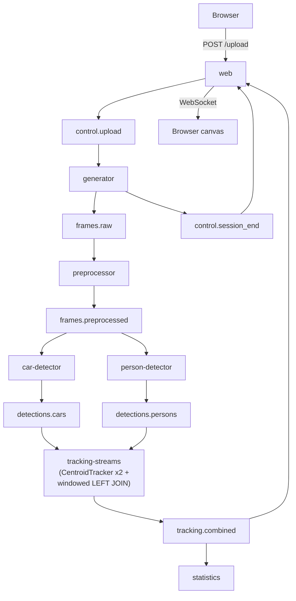
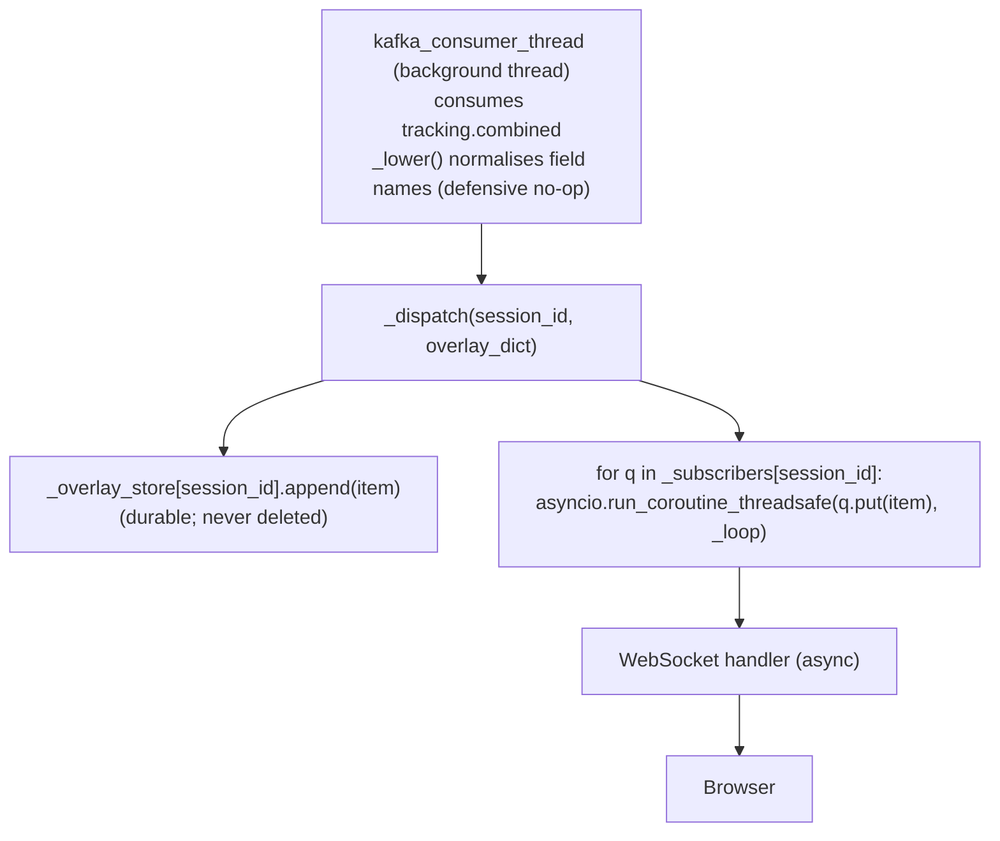
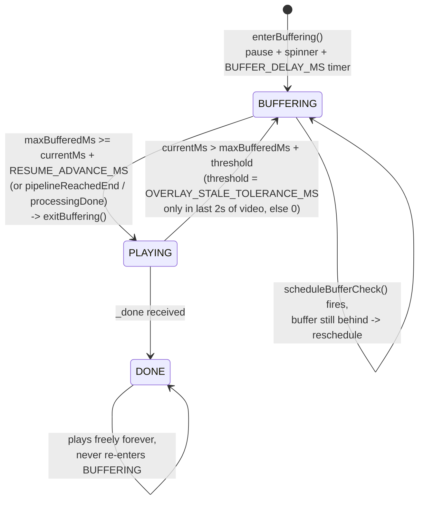

# System Patterns

## Message Flow



## Kafka Topic Design

| Topic | Partitions | Key | Notable Config |
|---|---|---|---|
| control.upload | 1 | session_id | 4 KB max |
| control.session_end | 1 | session_id | 4 KB max |
| frames.raw | 3 | session_id | 5 MB max |
| frames.preprocessed | 3 | session_id | 5 MB max |
| detections.cars | 3 | session_id | 256 KB max |
| detections.persons | 3 | session_id | 256 KB max |
| tracking.combined | 3 | session_id | 256 KB max, written by tracking-streams |

`hash(session_id) % 3` routes all messages for one session to the same partition — preserving per-session ordering without a coordinator.

## Per-Session State Pattern

All stateful services use `dict[session_id, ...]` maps (or per-key state stores) rather than global counters:
- `tracking-streams`: per-object-type Kafka Streams state stores (`car-tracker-state`, `person-tracker-state`) keyed by `session_id`, holding `CentroidTracker` state and the cumulative `total_unique` count
- `web/main.py`: `_overlay_store`, `_session_done`, `_subscribers`
- `statistics/main.py`: `_sessions: dict[str, dict]`

## Delayed `_done` Signal Pattern (web)

`control.session_end` arrives ~8 s after upload (generator finishes quickly), but the detection pipeline keeps running for `total_frames / DETECTION_FPS_ESTIMATE` more seconds. `web/main.py` delays its `_done` dispatch using `threading.Timer`:

```python
delay = max(MIN_DONE_DELAY_S, total_frames / DETECTION_FPS_ESTIMATE)
threading.Timer(delay, _send_done).start()
```

This prevents the WebSocket from closing before all `tracking.combined` records for the session have arrived.

## Web Service: Overlay Fan-Out



New WebSocket connections first replay `_overlay_store` (catch-up), then drain live from their subscriber queue.

The windowed join may emit two messages per frame (first with null person data, second with both). The browser `overlayBuffer.set(ts, payload)` overwrites, so only the final payload renders.

## Buffer-Aware Playback (Browser)



`RESUME_ADVANCE_MS = BUFFER_DELAY_MS / 2` (2s by default) is the resume hysteresis — the
pipeline must be at least that far ahead of the playhead before playback resumes, which
stops the player flapping between play/pause every frame.

`OVERLAY_STALE_TOLERANCE_MS = 500` prevents spurious end-of-video stalls caused by the
structural gap between the last emitted overlay and `vid.duration`; it only applies in the
last 2 seconds of the video.

## Shared Image Pattern (detector)

Car and person variants share one Docker image with different runtime env vars:
```yaml
car-detector:
  image: car-detector:${PROCESSING_UNIT_TYPE:-cpu}
  environment:
    CLASS_IDS: "2,5,7"
    OUTPUT_TOPIC: detections.cars
    GROUP_ID: detector-cars

person-detector:
  image: person-detector:${PROCESSING_UNIT_TYPE:-cpu}
  environment:
    CLASS_IDS: "0"
    OUTPUT_TOPIC: detections.persons
    GROUP_ID: detector-persons
```

## Kafka Streams Topology (`tracking-streams`)

Implemented in `services/tracking-streams` (Java, `Main.java` / `TrackingProcessor.java`).

### Per-object-type tracking → rekey
- `detections.cars` and `detections.persons` are each processed by a `CentroidTracker` backed by a persistent state store (`car-tracker-state` / `person-tracker-state`), keyed by `session_id`. State stores are never cleaned up (matches `_overlay_store`'s never-deleted pattern).
- Two-pass cascade matching per frame (see `CentroidTracker.java`):
  1. **IoU pass** — greedily pairs existing tracks ↔ new detections by IoU ≥ `MIN_IOU` (0.1), highest overlap first. Keeps a track's ID stable for objects growing in frame (e.g. approaching camera) where the centroid barely moves but IoU stays high.
  2. **Centroid pass** — remaining unmatched tracks/detections are paired by nearest centroid distance, capped at `MAX_DISTANCE` (200px).
  - Tracks unmatched in either pass for `MAX_DISAPPEARED` (30) frames are dropped; unmatched detections become new tracks. Each tracker keeps a cumulative set of every track ID it has ever seen → `*_total` (unique count) per session.
- Each tracked stream is rekeyed by `session_id + "_" + frame_number`

### Windowed Stream-Stream JOIN → `tracking.combined`
- LEFT JOIN (cars anchored) within a 2-second window, 500 ms grace period
- Output rekeyed by `session_id`, written to `tracking.combined` (consumed by **both** `web` and `statistics`)
- Field names in the Kafka topic are already lowercase (`car_tracks`, `video_timestamp_ms`, `cars_total`, `persons_total`, etc.)
